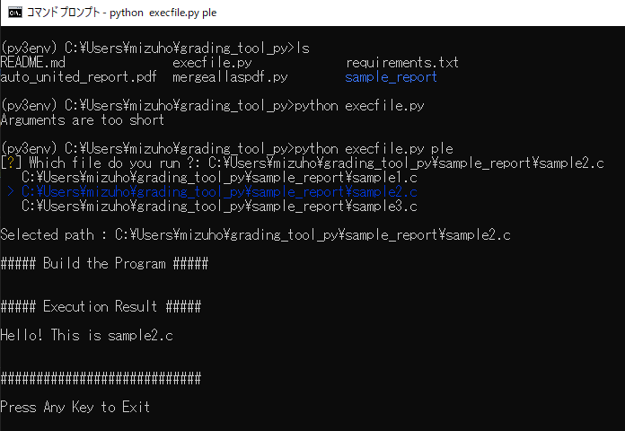

# Grading Tool for Computer Software Class

## Environments
- Developed for Windows OS.
- Python 3.8 or higher
- `pip install -r requirements.txt`
- Working `gcc` command on your command line.

## Merge submitted files
### Submitted objects from a student :
```
─ sample_report
   ├─ sample.txt
   ├─ sample_report.pdf
   ├─ sample1.c
   ├─ sample2.c
   ├─ sample3.c
   ├─ sample_image_1.png
   ├─ sample_image_2.png
   ├─ sample_image_3.png
   ├─ sample_image_overview.png        
   └─ result2.png
```

### Run `python mergeallaspdf.py` to unite all submitted files as a pdf.

### See automatically united report : 
[auto_united_report.pdf](./auto_united_report.pdf)

## Execute student's C program.
### Run `execfile.py file_query root_directory` to execute specific program.

